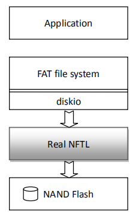

# NFTL

## 介绍

NFTL 是上海睿赛德电子科技有限公司专为微控制器开发的 NAND Flash 转换层。 NFTL 全称 NAND Flash Translation Layer，即 NAND 闪存转换层，它是上层 FAT 文件系统和 NAND  Flash 驱动中间的一层，用于把文件系统的块设备操作转换成对 NAND Flash 的块、页方式的操作。




NAND Flash 闪存以块为单位进行擦除操作。闪存的写入操作必须在空白区域进行，如果目标区域已经有数据，必须先擦除后写入，因此擦除操作是闪存的基本操作。并不能够按照块设备方式，进行直接读写操作。 

## 功能说明

NFTL 转换层包括以下方面的功能实现： 

- 逻辑到物理地址转换。为了进行磨损均衡和坏块管理，不能直接寻址进行读写操作，因此逻辑块需要动态地映射到某个物理块。 
- 坏块管理。NAND Flash 芯片出厂时，某些块就标记为坏块，在使用一段时问后，某些块也可能变得不可用，因此需要对这些块进行标记和管理，记录坏块信息，进行坏块替换等操作。 
- 磨损均衡。磨损均衡主要是为了均衡整个存储器各单元的使用寿命。由于 Flash 有一定的使用寿命，NAND Flash 一般可擦除的次数为 10 万次，所以随着使用次数的增加，会有一些单元逐渐变得不稳定或失效。因此，要尽量避免频繁地对同一块地址操作，以免造成局部单元提前损坏；同时，由于擦除操作耗时较多，也应尽量减少擦除操作，最终达到擦写次数均衡。 
- 校错纠错。所有 Flash 器件都存在位差错现象，而且更多见于 NAND Flash。在某些情况下一个比特位会发生翻转，但是一个位的翻转并不见得这个块就已经变成了坏块。一位坏块也可以通过 ECC 算法进行纠正过来。
- 日志记录。为了避免掉电时丢失不必要的数据，在 Real NFTL 中实现了 NAND Flash 操作的日志记录。当掉电情况发生时，能够恢复出上一个保存时间点的数据信息。

## 使用说明

### 相关 API 接口

#### NFTL 初始化

在使用 NFTL 层之前需要进行初始化：在一个 MTD NAND 设备上把 NFTL 层加载上去，并扫描 NAND Flash 闪存，进行 NFTL 层的初始化。 

```
rt_err_t nftl_attach(const char* mtd_device);
```

调用 `nftl_attach` 函数之后，就可以按照使用块设备的方式使用 MTD 设备了。可以直接在上面挂载 elm 文件系统，如下所示：

```c
int mnt_init(void)
{
    /* 在 MTD 设备上 attach NFTL 层，将其转化为块设备 */
	nftl_attach("nand0");

	/* 在附属了 NFTL 层的 MTD 设备上挂载文件系统 */
	if (dfs_mount("nand0", "/", "elm", 0, 0) == 0)
	{
		rt_kprintf("Mount FatFs file system to root, Done!\n");
	}
	else
	{
		rt_kprintf("Mount FatFs file system failed.\n");
	}
	return 0;
}
```

#### 闪存页操作 

页操作主要包含闪存页的读、写和擦除。这其中的每个页都是文件系统看到的逻辑页，并不是实际闪存中的物理页。 

**页读取操作：** 

```c
rt_err_t nftl_read_page(struct rt_mtd_nand_device *device,
                        rt_uint16_t block_offset,
                        rt_uint16_t page_offset,
                        rt_uint8_t *buffer);
rt_err_t nftl_read_multi_page(struct rt_mtd_nand_device *device,
                              rt_uint16_t block_offset,
                              rt_uint16_t page_offset,
                              rt_uint8_t *buffer,
                              rt_size_t count);
```

`nftl_read_page` 和 `nftl_read_multi_page` 函数分别用于读取页和多页。其中各参数的意义： 

| 参数             | 说明                             |
| ---------------- | -------------------------------- |
| **device**       | MTD NAND 设备；                  |
| **block_offset** | 读取页位于 NAND 中哪个块号；     |
| **page_offset**  | 读取页位于 NAND 中块内哪个页号； |
| **buffer**       | 用于存放页的数据缓冲区；         |
| **count**        | 读取的页数目。                   |

> **注:** buffer 指向的缓冲区大小，必须能够放入一个页的数据，即如果页大小是 2048，那么buffer 至少有 2048 大小。 

**页写入操作：** 

```
rt_err_t nftl_write_page(struct rt_mtd_nand_device *device,
                         rt_uint16_t block_offset,
                         rt_uint16_t page_offset,
                         const rt_uint8_t *buffer);
rt_err_t nftl_write_multi_page(struct rt_mtd_nand_device *device,
                               rt_uint16_t block_offset,
                               rt_uint16_t page_offset,
                               const rt_uint8_t *buffer,
                               rt_size_t count);
```

`nftl_write_page` 和 `nftl_write_multi_page` 函数分别用于把一页或多页数据写入到 Flash 中。其中各参数的意义： 

| 参数             | 说明                             |
| ---------------- | -------------------------------- |
| **device**       | MTD NAND 设备；                  |
| **block_offset** | 写入页位于 NAND 中哪个块号；     |
| **page_offset**  | 写入页位于 NAND 中块内哪个页号； |
| **buffer**       | 用于存放写入页的数据区；         |
| **count**        | 写入的页数目。                   |

**擦除页操作：** 

```
rt_err_t nftl_erase_pages(struct rt_mtd_nand_device *device,
                          rt_uint32_t page_begin,
                          rt_uint32_t page_end);
```

`nftl_erase_pages` 函数用于擦除页，其中 page_begin 和 page_end 指定了初始页和结束页。 

> **注:** 擦除页并不需要页处于块的边界上，NFTL 会自动标记这些页为脏页，当一个块内所有页都是脏页时，这个块将被擦除。

**刷新** Flash 操作

```
rt_err_t nftl_mapping_flush(struct rt_mtd_nand_device* device);
```

`nftl_mapping_flush` 函数用于把 NFTL 中的缓冲数据刷新到闪存中。刷新到内存成功，也意味着在闪存上创建一个可恢复的时间点。当掉电后，系统重启至少可以把数据、文件系统恢复到最近保存成功的时间点。 

**纠错操作**

NAND Flash 有一定条件概率出现位翻转现象。NFTL 层提供了软件方式的 2 bit 检查，1 bit 纠错的软件 ECC（Error Checking & Correction）算法。 

```
int nftl_ecc_verify256(rt_uint8_t *data,
                       rt_uint32_t size,
                       const rt_uint8_t *code);
void nftl_ecc_compute256(const rt_uint8_t *data,
                         rt_uint32_t size,
                         rt_uint8_t *code);
```

`nftl_ecc_verify256` 用于验证数据是否和 ECC code 相匹配。参数及返回值情况如下：

| **参数** | **说明**               |
| -------- | ---------------------- |
| **data** | 需要校验的数据；       |
| **size** | 校验数据的长度；       |
| **code** | 原有的 ECC code 数据； |

**返回值：**

如果 ECC 数据吻合，则返回 RT_MTD_EOK (值：0)；如果数据不吻合，返回非 0 值。

`nftl_ecc_computer256` 函数用于根据提供的数据，生成新的 ECC code。参数及返回值情况如下： 

| **参数** | **说明**                   |
| -------- | -------------------------- |
| **data** | 需要生成 ECC code 的数据； |
| **size** | 数据的长度；               |
| **code** | 返回的 ECC code 数据；     |

> **注:** NFTL 软件 ECC 算法是按照 Hamming code 算法进行实现，每 256 字节会产生 3 bytes ECC code，所以对于 2048 的大页 NAND Flash，需要 24 字节的数据空间。

**设置** **NFTL** **的** **LOG** **等级**

```
void log_trace_set_level(int level);
```

`log_trace_set_level` 函数用于设置 NFTL 内部的日志等级，它会通过 ***log_vprintf*** 接口输出 

相应的日志信息。其中`level`参数取值范围是：0 - 7，默认的等级是 3。 

**多分区支持**

Real NFTL 仅处理了 MTD NAND 设备上的闪存转换层，而分区是上层文件系统的概念。所以针对于多分区的支持主要依赖于上层文件系统多分区的支持。这里以 ELM FatFS 为例描述如何在 Real NFTL 上让 FatFS 支持多分区。 

在 FatFS 中，与底层驱动接口的一层称之为 DISK IO，分别包含: 

- disk_initialize - Initialize disk drive 

- disk_status - Get disk status 

- disk_read - Read sector(s) 

- disk_write - Write sector(s) 

- disk_ioctl - Control device dependent features 

对每一个 disk_* API 接口，第一个参数都是 BYTE pdrv 参数，它的意义指明了从哪个分区读取扇区。多分区支持上，可以在 DISK IO 这一接口层建立一个逻辑驱动器表，在其中标识出每个分区的开始块号和结束块号，例如： 

```
/* partition block map: {start, end} */
static const unsigned int partition[3][2] =
{
    {0, 127}, /* part0, block: 0~127, sector=2KB, 16MB */
    {128, 255}, /* part1, block:128~255, sector=2KB, 16MB */
    {256, 408}, /* part2, block:256~408, sector=2KB, 19MB */
};
```

在上面的代码中，partition 表格指定了三个分区（例如 K9F1G08，1 块包括 64 个页，每 

页大小 2048。对于上层 FAT 文件系统而言，扇区大小=页大小）： 

- 第一个分区，从 0 - 127 块，总计 16MB 容量； 

- 第二个分区，从 128 - 255 块，总计 16MB 容量； 

- 第三个分区，从 256 - 408 块，总计 19MB 容量； 

**注:** 

1. 当使用 Real NFTL 层时，NAND Flash 上会保留一定空间用于坏块替换，文件系统能够看到的块数是实际块的 0.8 倍，即 K9F1G08，总计 1024 个块，文件系统能够使用的空间是 819 个块=102MB。 

2. 分区表中标记的是逻辑块号，但能够使用的总数是 NAND Flash 实际的块总数。 

3. 如果需要初始时就在 NAND Flash 中保留一部分块，需要在 MTD Nand 驱动中进行相应的设置。 

4. 如果在多任务环境中使用，需要在 DiskIO 接口中加入**锁的互斥机制**，参见 nftl/os/nftl_diskio.c 中的 LOCK_INIT/LOCK_TAKE/LOCK_RELEASE 宏定义，并按照多任务环境系统，把他们定义成正确的值。 

**NAND Flash** **驱动接口**

Real NFTL 定义了底层的 NAND Flash 驱动规范接口，称之为 MTD NAND 驱动接口，它由如下结构体组成： 

```
struct rt_mtd_nand_device
{
    struct rt_device parent;
    rt_uint16_t page_size; /* The Page size in the flash */
    rt_uint16_t oob_size; /* Out of bank size */
    rt_uint16_t oob_free; /* the free area in oob that flash driver not use */
    rt_uint16_t plane_num; /* the number of plane in the NAND Flash */
    rt_uint32_t pages_per_block; /* The number of page a block */
    rt_uint16_t block_total;
    rt_uint32_t block_start; /* The start of available block*/
    rt_uint32_t block_end; /* The end of available block */
    /* operations interface */
    const struct rt_mtd_nand_driver_ops *ops;
};
```

在这个结构体中，成员 block_start 和 block_end 指定了 NAND Flash 中由 NFTL 管理的起始块及结束块。如果不需要由 Real NFTL 管理整个 NAND Flash 闪存，可以设置适当的起始块号（如果需要留出前面部分的闪存区域）或结束块号（如果需要留出后面部分的闪存区域）。 

其中驱动设备接口由结构体 struct rt_mtd_nand_driver_ops 操作结构体组成： 

```
struct rt_mtd_nand_driver_ops
{
    rt_err_t (*read_id)(struct rt_mtd_nand_device *device);
    rt_err_t (*read_page)(struct rt_mtd_nand_device *device,
                          rt_off_t page,
                          rt_uint8_t *data, rt_uint32_t data_len,
                          rt_uint8_t *spare, rt_uint32_t spare_len);
    rt_err_t (*write_page)(struct rt_mtd_nand_device *device,
                           rt_off_t page,
                           const rt_uint8_t *data, rt_uint32_t data_len,
                           const rt_uint8_t *spare, rt_uint32_t spare_len);
    rt_err_t (*move_page)(struct rt_mtd_nand_device *device,
                          rt_off_t src_page, rt_off_t dst_page);
    rt_err_t (*erase_block)(struct rt_mtd_nand_device *device,
                            rt_uint32_t block);
    rt_err_t (*check_block)(struct rt_mtd_nand_device *device,
                            rt_uint32_t block);
    rt_err_t (*mark_badblock)(struct rt_mtd_nand_device *device,
                              rt_uint32_t block);
};
```

**相应的驱动实现接口说明：**

| **接口**          | **说明**                                     |
| ----------------- | -------------------------------------------- |
| **read_id**       | 读取 NAND Flash ID。                         |
| **read_page**     | 读取 NAND Flash 页                           |
| **write_page**    | 写入 NAND Flash 页                           |
| **move_page**     | 把 NAND Flash 的一个页数据复制到另外一个页上 |
| **erase_block**   | 擦除块                                       |
| **check_block**   | 检查块状态<在 Real NFTL 中未使用>            |
| **mark_badblock** | 设置块为坏块<在 Real NFTL 中未使用>          |

**注:** 

- 其中 check_block 和 mark_badblock 接口并未使用，可以在 rt_mtd_nand_ops 结构体中赋值成 NULL。 

- 如果 NFTL 层使用在多任何环境中，且 NAND 也会被其他多任务程序所使用，**请在** **NAND 驱动接口上加入锁的互斥机制**。 


