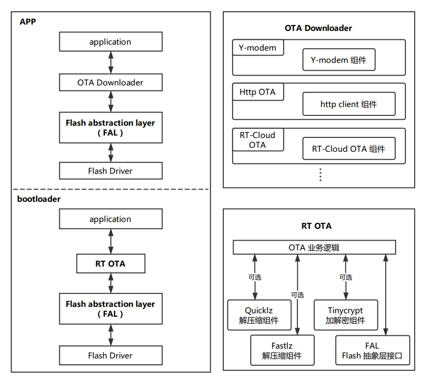

# rt_ota 介绍 #

**rt_ota** 是 RT-Thread 开发的跨 OS、跨芯片平台的固件空中升级技术（Firmware Over-the-Air Technology），轻松实现对设备端固件的管理、升级与维护。

RT-Thread 提供的 OTA 固件升级技术具有以下优势：

- 固件防篡改 ： 自动检测固件签名，保证固件安全可靠
- 固件加密 ： 支持 AES-256 加密算法，提高固件下载、存储安全性
- 固件压缩 ： 高效压缩算法，降低固件大小，减少 Flash 空间占用，节省传输流量，降低下载时间
- 差分升级 ： 根据版本差异生成差分包，进一步节省 Flash 空间，节省传输流量，加快升级速度
- 断电保护 ： 断电后保护，重启后继续升级
- 智能还原 ： 固件损坏时，自动还原至出厂固件，提升可靠性
- 高度可移植 ： 可跨 OS、跨芯片平台、跨 Flash 型号使用，不依赖具体的 OTA 服务器

## 文件目录结构

``` {.c}
rt_ota
│   README.md                       // 软件包使用说明
│   SConscript                      // RT-Thread 默认的构建脚本
├───docs 
│   │   api.md                      // API 使用说明
│   │   introduction.md             // 软件包详细介绍
│   │   port.md                     // 移植说明文档
│   └───user-guide.md               // 用户手册
├───inc                             // 头文件
├───libs                            // 库文件
├───ports                           // 移植文件
│   └───temp                  
│           rt_ota_key_port.c       // 移植文件模板
├───samples                         // 示例代码
│   └───ota.c                       // 软件包应用示例代码
└───tools                           // 工具
        fatfs_ota_packaging_tool    // fatfs 文件系统 OTA 打包工具
        firmware_ota_packaging_tool // OTA 文件打包工具（rbl文件）

```

## rt_ota 软件框架图 ###



如上图所示，该应用框架图展示了 rt_ota 在整个 OTA 应用中所处的位置，以及 rt_ota 应用所涉及到的相关软件组件包。

从 **rt_ota 软件框架图**中可以看到，APP 部分的软件是不需要依赖 rt_ota 软件包的。因为，APP 部分只需要关心如何把升级固件从 OTA 服务器下载到设备，而涉及到系统安全与稳定性的固件校验和固件搬运环节才需要 rt_ota 介入。

**OTA Downloader** 是与 OTA 服务器对应的客户端程序，用于将 OTA 固件从 OTA 服务器下载到设备。常用的且通用的 **OTA Downloader** 有 `Y-modem`（串口升级） 和 `HTTP OTA`（网络升级），开发者使用自己的电脑既可搭建用于 OTA 升级的服务端。私有云或者公有云平台提供的 OTA 服务器，通常需要开发对应的客户端程序，运行在设备端，用于下载 OTA 固件。

## rt_ota 功能特点 ##

### 加密 ###

为什么要选择加密？

- 未加密的固件可以被任何人以任何方式窃取使用，还可能面临固件被篡改、系统被攻击、产品被山寨等风险
- 客户使用的 OTA 服务多是第三方服务，客户的固件需要上传到第三方服务器，或者发送给第三方机构，固件很容易被泄漏、传播，或恶意使用

为了避免未加密固件存在的各种问题，**rt_ota** 对固件使用了 AES256 加密方式。

> AES（Advanced Encryption Standard）是美国联邦政府采用的一种分组加密标准，也是目前分组密码实际上的工业标准。

**rt_ota** 采用了 [**TinyCrypt**](https://github.com/RT-Thread-packages/tinycrypt) 软件包中实现的 AES256 加密算法，解密速度快，资源占用小。

> 未开优化情况下，[**TinyCrypt**](https://github.com/RT-Thread-packages/tinycrypt) 占用 ROM 5244 字节，占用 RAM 8744 字节。


### 压缩 ###

为什么要支持压缩？  

    嵌入式设备的 Flash 资源往往都比较有限（通常只有 2M 字节），在有限的 Flash 上通常需要存储 Bootloader、应用程序（app）、OTA 固件、系统和用户参数配置等信息，这就使得可用的应用程序代码空间变得很小。

为了解决 Flash 资源受限的问题，RT-Thread OTA 引入了高效的压缩算法，来降低固件对 Flash 空间的占用。

目前 RT-Thread 完美支持了 Quicklz、Fastlz 和 MiniLZO 解压缩算法，并在 rt_ota 组件包支持使用 Quicklz 和 Fastlz。

下面表格统计了三种压缩算法在压缩率和资源占用上的对比：（非精准测试，仅供参考）

|名称      |版权 |ROM  | 解压时 RAM  |压缩级别  |压缩率|
|:--:     |:--: |:--: |:--:          |:--:     |:--:|
|quicklz  |GPL  |1838 |9732          |3        |67%  |
|fastlz   |MIT  |3096 |9696          |2        |74%  |
|miniLZO  |GPL  |2024 |9604          |LZO1X_1  |75%  |

### 防纂改 ###

OTA 固件通常是暴露在外网中的，如果固件未经过加密和防篡改处理，就会面临以下问题：

- OTA 固件存放在第三方 OTA 服务器，不受信
- OTA 固件升级下载的过程中，可能被截获，被恶意篡改，不安全
- OTA 固件可能被非法获取，被破解，产品可能被山寨

为了保证客户固件的安全，以及 OTA 升级的可靠，RT-Thread OTA 默认集成了防篡改功能，检查速度快，可靠性强。

### 差分升级

**差分升级** 是将设备固件与新版固件的差异部分以既定的组织格式打成差分包然后进行升级的一种技术。

在嵌入式设备中常用的差分升级多是 `多 bin 升级` 方式，有效地降低了差分升级的复杂度。

**多 bin 升级**，通常是将一个应用程序划分成不同的部分，生成多个 bin 文件，通过编译器分别链接到 Flash 的不同位置，每次升级只升级其中的一个 bin 文件。

相对于整包升级，差分升级具有以下优势：

- 差分包相对较小，流量成本低
- 下载和升级速度较快，升级时间短
- 网络条件要求低，适用于 LoRa 和 NBiot 应用场景
- 有效减少电能消耗

### 断电保护

**断电保护** 功能主要应用在 OTA 升级过程中，设备突然断电的场景中。如果没有断电保护功能，设备很有可能因为只升级了一部分固件而变砖返厂。

RT-Thread OTA 安全保护机制的 **断电保护** 功能，保证设备升级过程中即使出现了异常中断，下次上电设备仍会继续进行升级，不会导致固件损坏设备变砖。

### 智能还原

设备可能会因为外部攻击、升级过程中断或者其它某种原因导致设备固件异常，即使发生了这种情况，RT-Thread OTA 安全保护机制的 **智能还原** 功能也可以智能地还原设备固件，从而有效保证设备程序正确稳定地运行。
