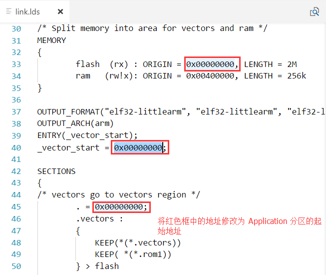
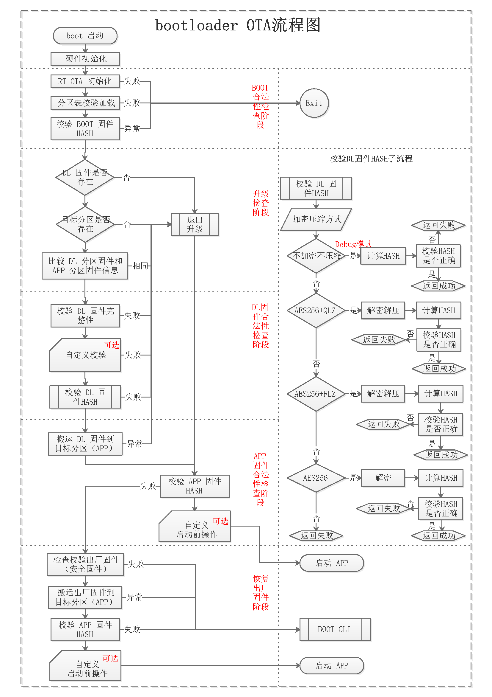

# rt_ota 使用说明 #

## 使用前的准备

### 依赖软件包下载与移植

#### FAL（必选）  

FAL 软件包下载：  

> git clone https://github.com/RT-Thread-packages/fal.git

FAL 软件包移植参考 FAL [README](https://github.com/RT-Thread-packages/fal/blob/master/README.md)。

#### Quicklz 或者 Fastlz（可选）  

Quicklz 和 Fastlz 是 rt_ota 支持的解压缩软件包，用户可以选择使用其中的一个。

Quicklz 软件包下载：  

> git clone https://github.com/RT-Thread-packages/quicklz.git

在 OTA 中启用压缩并且使用 Quicklz 需要在 **rtconfig.h** 文件中定义以下宏定义：

``` {.c}
#define RT_OTA_USING_CMPRS                // 启用解压缩功能
#define RT_OTA_CMPRS_ALGO_USING_QUICKLZ   // 使用 Quicklz
#define QLZ_COMPRESSION_LEVEL 3           // 定义使用 Quicklz 3级压缩
```

Fastlz 软件包下载：  

> git clone https://github.com/RT-Thread-packages/fastlz.git

在 OTA 中启用压缩并且使用 Quicklz 需要在 **rtconfig.h** 文件中定义以下宏定义：

```
#define RT_OTA_USING_CMPRS                // 启用解压缩功能
#define RT_OTA_CMPRS_ALGO_USING_FASTLZ    // 使用 Fastlz
```

#### TinyCrypt（可选）  

TinyCrypt 是 rt_ota 中使用的用于固件加密的软件包，支持 AES256 加解密。

TinyCrypt 软件包下载：  

> git clone https://github.com/RT-Thread-packages/tinycrypt.git

在 OTA 中启用压缩并且使用 TinyCrypt 需要在 **rtconfig.h** 文件中定义以下宏定义：

```
#define RT_OTA_USING_CRYPT               // 启用 Tinycrypt 组件包
#define TINY_CRYPT_AES                   // 启用 AES 功能
#define RT_OTA_CRYPT_ALGO_USING_AES256   // 启用 AES256 加密功能
```

### rt_ota 软件包下载与移植

**rt_ota** 是闭源包，请联系 [**RT-Thread**](https://www.rt-thread.org/) 获取使用权。

如果您已经拿到 **rt_ota** 的使用权，并下载到了 **rt_ota** 软件包，请详细阅读软件包中的相关说明文档，完成移植工作，参考 **rt_ota** 移植文档。

### 定义配置参数

**依赖软件包下载与移植** 章节中描述的配置宏定义需要定义到 **rtconfig.h** 文件中，参考文件如下所示：（开发者根据自己的需求配置相关宏定义）

```
#define RT_USING_RT_OTA                 // 启用 RT_OTA 组件包
#define RT_OTA_USING_CRYPT               // 启用 Tinycrypt 组件包
#define TINY_CRYPT_AES                   // 启用 AES 功能
#define RT_OTA_CRYPT_ALGO_USING_AES256   // 启用 AES256 加密功能
#define RT_OTA_USING_CMPRS               // 启用解压缩功能
#define RT_OTA_CMPRS_ALGO_USING_QUICKLZ  // 启用 Quicklz
#define QLZ_COMPRESSION_LEVEL 3          // 定义使用 Quicklz 3级压缩
#define FAL_PART_HAS_TABLE_CFG           // 启用分区表配置文件（不启用需要在 Flash 中查找）
```

## 开发 bootloader

**rt_ota** 软件包完成的是固件校验、认证、搬运的工作，需要配合 BootLoader 中使用，因此用户在拿到 **rt_ota** 软件包后，需要按照自己的需求开发 BootLoader 程序。

1. 开发者首先需要创建目标平台的 BootLoader 工程（可以是裸机工程）
2. 将 **rt_ota** 软件包拷贝到 BootLoader 工程目录
3. 将 **FAL** 软件包拷贝到 BootLoader 工程目录，并完成移植工作，参考 FAL [README](https://github.com/RT-Thread-packages/fal/blob/master/README.md)
4. 将 **Quicklz** 或者 **Fastlz** 软件包拷贝到 BootLoader 工程目录（如果需要解压缩功能）
5. 将 **TinyCrypt** 软件包拷贝到 BootLoader 工程目录（如果需要加密功能）
6. 将 **定义配置参数** 章节中的 **rtconfig.h** 文件拷贝到 BootLoader 工程
7. 开发 OTA 具体的业务逻辑，参考 bootloader&OTA 整体流程图（详见参考章节），参考 sample 说明文档

## 开发 APP

APP 中所要完成的工作主要是讲 OTA 升级文件下载到设备的 Flash 中。

1. 建立 RT-Thread 应用程序工程
2. 使用 RT-Thread 的包管理器打开 FAL 组件包，并完成移植工作，参考 FAL [README](https://github.com/RT-Thread-packages/fal/blob/master/README.md)（移植代码可以与 Bootloader 中的通用）
3. 选择一个 OTA Downloader（RT-Thread 包管理工具提供 Y-modem 和 HTTP OTA）
    - Ymodem
    - HTTP OTA
    - 其它（需要自行开发 OTA 固件下载客户端程序）
4. 开发应用程序业务逻辑
5. 修改链接脚本配置

通常，我们的程序都是从 Flash 代码区的起始地址开始运行的。但是，Flash 代码区的起始地址开始的空间被 bootloader 程序占用了，因此我们需要修改链接脚本，让 application 程序从 Flash 的 application 区域起始地址开始排放。

一般，我们只需要修改链接脚本里中 Flash 和 SECTION 段的起始地址为 application 分区的起始地址即可。application 分区信息必须跟对应 MCU 平台的 Flash 分区表完全一致。

以 GCC 链接脚本为例，修改示例如下图所示：



6. 修改链接脚本后，重新编译生成固件 **rtthread.bin**。

## OTA 固件打包

编译器编译出来的应用程序 `rtthread.bin` 属于原始固件，并不能用于 RT-Thread OTA 的升级固件，需要用户使用 `RT-Thread OTA 固件打包器` 打包生成 `.rbl` 后缀名的固件，然后才能进行 OTA 升级。

`RT-Thread OTA 固件打包器` 如下图所示：


用户可以根据需要，选择是否对固件进行加密和压缩，提供多种压缩算法和加密算法支持，基本操作步骤如下：

- 选择待打包的固件
- 选择生成固件的位置
- 选择压缩算法
- 选择加密算法
- 配置加密密钥 （不加密则留空）
- 配置加密 IV （不加密则留空）
- 填写固件名称 （对应分区名称）
- 填写固件版本
- 开始打包
- OTA 升级

**Note：**

- **加密密钥** 和 **加密 IV** 必须与 BootLoader 程序中的一致，否则无法正确加密固件
- 固件打包过程中有 **`固件名称`** 的填写，这里注意需要填入 Flash 分区表中对应分区的名称，不能有误（通常应用程序区名称为 `app`）

## 开始升级

如果开发者使用的 OTA 下载器部署在公网服务器，则需要将 OTA 升级固件上传到对应的服务器中。

如果开发者使用的是 Y-modem 方式，需要在 RT-Thread MSH 命令行中输入 `update` 命令来进行升级。

> 不同 OTA 升级方式的操作方法，请参考对应升级方式的用户手册。

## 参考

- bootloader&OTA 整体流程图



- RT_OTA 软件框架图


## 注意事项 ##

- 固件打包工具中使用的 **加密密钥** 和 **加密 IV** 必须与 BootLoader 程序中的一致，否则无法正确加密固件
